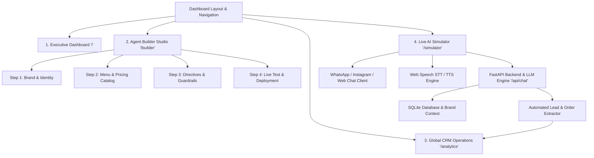

# Kayanova Agent Studio — Comprehensive System Specification

> **File:** `SYSTEM_OVERVIEW.md` / `README.md`  
> **Platform Name:** Kayanova Agent Studio  
> **Domain:** Multi-Tenant Enterprise Conversational AI Agent Studio, Dynamic Catalog Builder, and Live CRM Operations Platform  

---

## 1. Executive Summary & Core Mission

**Kayanova Agent Studio** is an enterprise-grade, multi-tenant AI Platform designed for agencies and businesses to configure, train, live-test, and deploy domain-specific AI customer service and sales agents in under 2 minutes.

The platform bridges three core pillars:
1. **Multi-Tenant Agent Configuration Studio:** Enables rapid creation of brand personas, dialect-tailored responses (Egyptian Arabic, Gulf Arabic, Standard Arabic, English), and strict operational guardrails.
2. **Dynamic Product & Service Catalog with Accurate Invoicing:** Structured item databases with official prices in EGP, preventing AI hallucination of pricing.
3. **Automated Real-Time CRM & Order Extraction Pipeline:** Captures incoming conversational customer intent, line items, delivery addresses, booking slots, and calculates numeric invoice totals automatically logged into a cross-brand CRM.

---

## 2. System Architecture & Component Hierarchy



---

## 3. Detailed Page Breakdown & Functionalities

### Page 1: Executive Dashboard (`/`)
* **Primary Objective:** High-level executive overview of all registered brands, key performance indicators, active brand spotlight, and quick switcher.
* **Key Components:**
  * **Top Metrics Bar (4 KPI Cards):**
    1. *Registered Brands Count* (with live status indicator).
    2. *Total Orders Volume* (with % growth badge).
    3. *AI Messages Handled* (with % growth badge).
    4. *Global Conversion & Uptime Rate* (e.g., 99.58%).
    5. *Trend Wave Sparklines* on each metric card.
  * **Active Brand Spotlight Hero Banner:**
    * Displays currently active brand avatar, name, category, and tagline.
    * Real-time status tags: `AI Active`, `Training Complete`, `Bookings Enabled`.
    * Direct Action Shortcuts: `Live Simulator`, `CRM & Orders`, `Agent Knowledge Base`, `Analytics`.
  * **Registered Brands Directory Grid (3-Column Layout):**
    * Multi-brand cards showing brand name, category badge, total captured orders count, language/dialect, official contact phone number.
    * Quick Actions per card: Single-click phone copy to clipboard with toast notification, and instant brand context switch (`⇄`).
    * Filter dropdown: Filter brands by industry (`Restaurant`, `Medical`, `Fashion/E-commerce`, `Real Estate`, `Services`).

---

### Page 2: AI Agent Builder Studio (`/builder`)
* **Primary Objective:** A streamlined 4-step wizard/studio to configure brand identity, menu pricing, behavior, and preview the agent.
* **Top Header Controls:**
  * `+ New Agent`: Resets form to create a clean, blank agent workspace.
  * `✨ 1-Click AI Auto-Fill`: Instant synthesis that populates menu items, pricing, rules, and greetings based on selected industry.
  * `💾 Save & Deploy`: Persists changes to local storage and SQLite database backend.

* **Step 1: Brand & Identity (`?step=identity`)**
  * **Input Fields:**
    * `Brand Name` (Text input, required).
    * `Agent Role Title` (Text input, e.g., "Customer Concierge & Order Specialist").
  * **Visual Industry Category Cards (Click to load presets):**
    * `☕ Restaurant & Cafe` (Coffee, bakery, food delivery).
    * `🦷 Medical & Dental Clinic` (Dental, 3D consultations, treatments).
    * `👗 Fashion & Retail Store` (Boutique, clothing, size advisors).
    * `🏢 Real Estate & Properties` (Property consultancy, residential, commercial).
    * `🌸 Spa & Wellness Sanctuary` (Massage, aromatherapy, yoga).
  * **Dialect & Tone Selector Pills:**
    * Dialect: `🇪🇬 Egyptian Arabic` | `🇸🇦 Gulf / Saudi` | `🌐 Standard Arabic` | `🇬🇧 English`.
    * Tone: `😊 Friendly & Warm` | `👔 Professional` | `✨ Luxury & High-End` | `⚡ Casual & Fast`.

* **Step 2: Menu, Products & Pricing Catalog (`?step=knowledge`)**
  * **Inline Item Creator Form:**
    * `Item / Service Name` (e.g., "Spanish Latte", "Teeth Whitening Zoom 4").
    * `Official Price in EGP` (Numeric input).
    * `Category / Department` (e.g., "Beverages", "Consultations").
    * `[+ Add Item]` button.
  * **Structured Items Table:**
    * Displays item name, category badge, numeric price in EGP, and delete action button.
    * `[Auto-Fill Category Menu]` button for instant catalog synthesis.
  * **Business & Branch Details Form:**
    * `Official Phone Number` (Customer support contact).
    * `Working Hours` (e.g., "Daily 08:00 AM - 12:00 Midnight").
    * `Branch Locations & Addresses` (e.g., "Maadi, Sheikh Zayed").

* **Step 3: Agent Directives & Smart Guardrails (`?step=behavior`)**
  * **Welcome Greeting Message:**
    * Textarea for the opening message sent to new customers.
  * **Smart Operational Guardrail Toggles:**
    * `🛡️ Strict Price Guardrail`: Enforces strict quoting strictly from official menu items; forbids hallucinating unlisted prices.
    * `📦 Order Info Collector`: Automatically prompts for customer name, delivery address, phone number, and items.
    * `📅 Booking & Time Slot Mode`: Gathers appointment date, time, and doctor/practitioner preferences.
  * **Custom Behavioral Prompt Directives:**
    * Textarea for custom business rules, return policies, delivery times, and etiquette.

* **Step 4: Live Test & Deployment (`?step=preview`)**
  * **Dual-Pane View:**
    * *Left Pane:* Interactive live chat sandbox to converse with the agent immediately.
    * *Right Pane:* Complete agent summary scorecard (Brand Name, Category, Dialect, Catalog item count, Support phone) + `Save & Deploy` and `Launch Full Simulator` buttons.

---

### Page 3: Global Multi-Brand CRM Operations (`/analytics`)
* **Primary Objective:** Aggregated multi-tenant CRM database tracking customer leads, itemized orders, delivery locations, and revenue pipeline.
* **Top KPI Summary:**
  * *Total System Revenue* (Sum of all numeric order values in EGP).
  * *Total Orders Volume* (Count of all orders).
  * *Unique Customers Base* (Deduplicated phone numbers).
  * *Fulfillment Ratio* (Completed orders vs Total).
* **Brand Filter Chips Bar:**
  * Horizontal scrollable chips: `All Brands (N)` or individual brand filters (`Bon & Vanilla (12)`, `Pearl Dental (8)`).
* **Search & Status Filters:**
  * Search input (filters by customer name, phone number, line items, address).
  * Status Dropdown: `All Statuses` | `New` | `In Progress` | `Completed`.
* **Global Orders Table Columns:**
  1. `Customer Name` (with initial avatar).
  2. `Phone Number` (clickable `tel:` link with phone icon).
  3. `Brand Name` (badge linking to brand workspace).
  4. `Items Ordered` (concatenated line items).
  5. `Total Amount` (bold numeric EGP).
  6. `Type & Delivery Address` (Delivery / Pickup / Medical Booking + Address).
  7. `Timestamp` (Relative time e.g., "15m ago" / "Today, 04:30 PM").
  8. `Status Dropdown` (Interactive in-row status updater: `New`, `In Progress`, `Completed`).
  9. `Actions` (View Details Drawer, Delete Order).
* **Features:**
  * `[Export Global CSV]` button: Generates UTF-8 BOM CSV spreadsheet file.
  * `Slide-Over Order Details Drawer`: Deep inspector for an individual order with printable receipt view.

---

### Page 4: Dual-Pane Live AI Chat Simulator (`/simulator`)
* **Primary Objective:** Realistic customer mobile chat experience with instant backend LLM response and real-time lead extraction inspection.
* **Layout Structure:**
  * **Top Channel Selector:** `WhatsApp` (green theme) | `Web Chat` (teal theme) | `Instagram DM` (gradient theme).
  * **Left Pane: Smartphone Device Mockup:**
    * Realistic bezel with Dynamic Island and live connection status.
    * Voice STT (Speech-to-Text via Web Speech API) microphone input.
    * Voice TTS (Text-to-Speech audio read-out) toggle.
    * Auto-scrolling chat history stream.
  * **Right Pane: Real-Time AI Debug Inspector:**
    * `Quick Test Scenarios`: 1-click test buttons (e.g., "Order 2 Spanish Lattes & Cheesecake", "Inquire about opening hours", "Book appointment tomorrow at 6 PM").
    * `Live Extracted Order Card`: Real-time display of captured customer name, phone, item list, calculated total EGP, and order intent.
    * `Active Persona Inspector`: Quick reference of active agent role, dialect, and menu size.

---

## 4. Data Models & Schemas

### Brand Profile (`BrandProfile`)
```typescript
interface BrandProfile {
  id: string;
  name: string;
  category: 'Restaurant' | 'Medical' | 'E-commerce' | 'Real Estate' | 'Services' | 'Other';
  iconType: 'coffee' | 'stethoscope' | 'shirt' | 'building' | 'briefcase' | 'bot' | 'sparkles';
  tagline?: string;
  role: string;
  tone: 'Professional' | 'Friendly' | 'Casual' | 'Luxury';
  language: string;
  dialect: 'Egyptian Arabic' | 'Gulf Arabic' | 'Modern Standard Arabic' | 'English';
  description?: string;
  welcomeMessage?: string;
  instructions?: string;
  promptRules?: string;
  menuItems?: MenuItem[];
  contactInfo?: {
    phone?: string;
    address?: string;
    hours?: string;
    workingHours?: string;
  };
  policies?: {
    delivery?: string;
    returns?: string;
    booking?: string;
  };
  defaultChannel: 'whatsapp' | 'instagram' | 'web';
  createdAt: string;
  updatedAt: string;
}
```

### Menu / Service Item (`MenuItem`)
```typescript
interface MenuItem {
  id: string;
  name: string;
  price: number;
  category: string;
  description?: string;
  available?: boolean;
}
```

### Extracted Lead & Order (`ExtractedLead`)
```typescript
interface ExtractedLead {
  id: string;
  brandId: string;
  customerName: string;
  customerPhone?: string;
  phone?: string;
  items: string[];
  orderLines?: Array<{
    name: string;
    quantity: number;
    unitPrice: number;
    lineTotal: number;
  }>;
  numericTotal?: number;
  totalAmount?: string;
  totalEstimated?: string;
  orderType?: 'Delivery' | 'Pickup' | 'Medical Booking' | 'General';
  deliveryAddress?: string;
  paymentMethod?: string;
  notes?: string;
  status: 'New' | 'In Progress' | 'Completed';
  intent?: string;
  channel?: string;
  confidence?: number;
  timestamp: string; // ISO 8601 string
}
```

---

## 5. Backend REST API Endpoints

### 1. Chat Completion & Lead Extraction
* **Endpoint:** `POST /api/chat`
* **Request Payload:**
```json
{
  "brand_id": "brand-bon-vanilla",
  "message": "عايز اطلب 2 سبانش لاتيه و1 كرواسون دليفري للمعادي",
  "history": [
    { "role": "assistant", "content": "أهلاً بحضرتك في بُن وفانيليا! تشرفنا بيك." }
  ]
}
```
* **Response Payload:**
```json
{
  "response": "تمام يا فندم! 2 سبانش لاتيه (150 EGP) و1 كرواسون لوز (60 EGP) بإجمالي 210 EGP. برجاء تزويدنا برقم التليفون والعنوان بالتفصيل في المعادي لتجهيز الأوردر فوراً.",
  "extractedLead": {
    "id": "lead-171890281",
    "brandId": "brand-bon-vanilla",
    "customerName": "عميل المعادي",
    "customerPhone": "01019827364",
    "items": ["2x سبانش لاتيه", "1x كرواسون باللوز"],
    "numericTotal": 210,
    "totalAmount": "210 EGP",
    "orderType": "Delivery",
    "deliveryAddress": "المعادي",
    "status": "New",
    "timestamp": "2026-08-16T15:00:00Z"
  }
}
```

### 2. Brands Management
* `GET /api/brands` - Fetch all brand profiles.
* `POST /api/brands` - Create new brand profile.
* `PUT /api/brands/{brand_id}` - Update existing brand profile.
* `DELETE /api/brands/{brand_id}` - Delete brand profile and its CRM records.

### 3. CRM Leads Management
* `GET /api/leads` - Fetch all captured leads across all brands (supports `?brand_id=...` filter).
* `POST /api/leads` - Manually create new order/lead.
* `PATCH /api/leads/{lead_id}/status` - Update status (`New` -> `In Progress` -> `Completed`).
* `DELETE /api/leads/{lead_id}` - Delete single lead.
* `DELETE /api/leads/brand/{brand_id}` - Purge all leads for a brand.

---

## 6. Complete Lovable / AI Prompt Specification

```text
Build a modern, high-contrast, clean Enterprise AI Agent Studio & Sales CRM web application called "Kayanova Agent Studio".

KEY REQUIREMENTS & PAGES:
1. EXECUTIVE DASHBOARD ('/'):
   - 4 Top KPI cards with trend wave sparklines (Registered Brands, Total Orders, AI Messages, Global Conversion 99.58%).
   - Active Brand Spotlight Hero card with live badge, brand avatar, status tags (AI Active, Training Complete, Bookings), and quick action pills.
   - 3-column Registered Brands directory grid with phone copy button, order counter, category tags, and brand context switcher.

2. AI AGENT BUILDER STUDIO ('/builder'):
   - 4-step streamlined progress tabs:
     Step 1: Brand & Identity (Name, Agent Role, visual clickable Category template cards [Restaurant, Dental Clinic, Fashion Store, Real Estate, Spa], Dialect pills [Egyptian, Gulf, Standard, English], Tone pills).
     Step 2: Menu & Pricing (Inline item creator [Name, Price in EGP, Category], structured table of items, branches & working hours).
     Step 3: Agent Directives (Welcome message textarea, smart guardrail switches: Strict Price check, Order Address collector, Booking slot collector, Custom prompt rules).
     Step 4: Live Test & Launch (Embedded interactive live chat sandbox to test agent + summary scorecard + 1-click Save & Deploy).
   - Top action buttons: "+ New Agent", "1-Click AI Auto-Fill" (populates sample menu, rules, and greeting in 1 second), and "Save & Deploy".

3. GLOBAL CRM OPERATIONS ('/analytics'):
   - KPI metrics (Total System Revenue in EGP, All Orders, Unique Clients, Fulfillment Ratio).
   - Filter chips bar by brand with order counts.
   - Search bar + Status dropdown filter (New, In Progress, Completed).
   - Global orders table with clickable phone numbers, brand badges, item lists, numeric totals, order types (Delivery/Pickup/Booking), relative timestamps, in-row status dropdown, and slide-over details drawer with printable receipt.
   - Export Global CSV button.

4. LIVE SIMULATOR ('/simulator'):
   - Channel switcher: WhatsApp, Web Chat, Instagram DM.
   - Smartphone mockup with chat bubble history, speech recognition mic input, voice TTS audio output.
   - Live AI Debug inspector on right pane with 1-click test scenario chips and real-time extracted lead details card.

THEME & AESTHETICS:
- Soft warm-slate background (#f4f6f8), crisp white card surfaces with rounded-3xl corners (24px) and soft diffused elevation shadows.
- Vibrant Mint Cyan/Emerald (#00d1b2) primary accent buttons.
- High contrast dark navy typography (#0f172a).
- Clean responsive layout with collapsible sidebar and top command search bar with Cmd+K.
```

---
*End of System Specification Document.*
